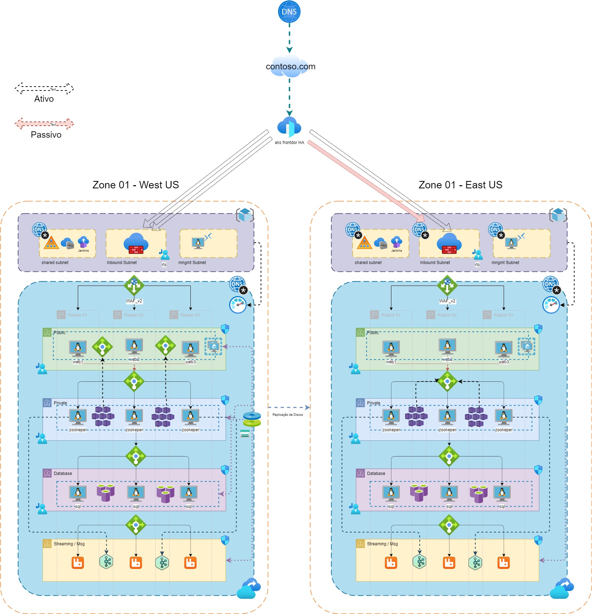

Requisitos :
**IAC**:

- [ ] Toda a infra deve ser provisionada a partir de um script chamado run.sh
- [ ] A infra deve ser provisionada via terraform (iuniciado pelo run.sh)
- [ ] Os itens de Iaas devem ser configurados via Ansible e integrados com o terraform dentro do modulo e não no default (main.tf raiz).
- [ ] As Imagens de vm devem ser criadas via Packer e ter um ciclo de destruição das mesmas.

Infraestrutura: 

- DNS: Hub deverá resolver spoke mas Spoke não resolverá Hub
- Os Acls devem ser feitos via Ip garantindo que somente itens já provisionados possam se comunicar
- !00% do trafego deverá passar pelo terraform
- Todos os itens devem ser monitorados,
- o Aks deve ser provisionado com o jenkins privado
- Os componentes do aks devem ser gerenciados pelo jenkins e deployados cada um com uma pipeline diferente
DR e Monitoramento:

- O kubernetes deverá funcionar em Ativo Ativo 
- Os itens em Iaas devem ser ativo passivo dependendo do load.
- Caso as vms tenham um load alto deveram ser provisionadas em uma segunda zona e ter seu serviço dividido.
- O Monitoramento deve informar quantas máquinas do cluster kafka estão em uso e conseguir utiliza-lo como metrica para provisionamento de novas máquinas dentro de sua propria zona
 ( metrica em linguagem neutra:
 if kafka cluster_cpu and ram use > 80% then provision +1 node wile use > 80% )

# Por onde vou começar

<!--- Eraser file: https://app.eraser.io/workspace/6Dmm3kkdMBwMDu63GKNU --->